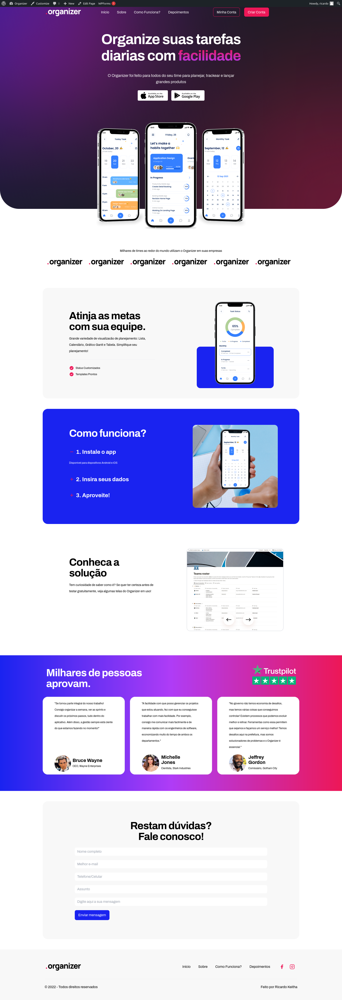

# Organizer - Site de teste

Este é um projeto feito para a entrevista técnica do processo seletivo da Nano Incub.

Foram utilizados as seguintes ferramentas para a criação desta landing page:

A versão utilizada do Sage é a 10. Requer PHP 8+

Para realizar a instalação, favor seguir este guia:
https://docs.roots.io/sage/10.x/existing-projects/#gathering-information

O banco de dados com a homepage construída está incluso, as credenciais de usuário para acesso ao backend do Wordpress são a seguinte:
Usuário: ricardo
Senha: wordpress

A imagem abaixo mostra a landing page completa em desktop. O site é responsivo e adapta-se para mobile também.

